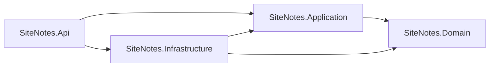

# Arquitetura e domínio do backend

O backend do SiteNotes segue Domain-Driven Design com domínio rico. A regra de negócio nasce na entidade, quando cabe nela, ou em um serviço, quando atravessa mais de um agregado. O projeto não usa o padrão handler (MediatR, `IRequestHandler`, command/query handler). Controller não decide regra e não fala com o banco.

O contrato HTTP permanece o mesmo: rotas, campos JSON e códigos de erro que o frontend já consome.

## Bounded context

Há um único contexto, o caderno de referências. Ele guarda páginas que a pessoa leu ou assistiu e o diário de anotações de cada página.

Fora do caderno existe um apoio de leitura: descobrir o título de uma URL. Isso não é um agregado persistido. É uma política de endereço mais uma porta de saída HTTP.

## Camadas

A dependência aponta para dentro. Domínio não referencia aplicação, infraestrutura nem API.



| Projeto | Responsabilidade |
| --- | --- |
| `SiteNotes.Domain` | Entidades, value objects, invariantes, serviço de domínio e portas de persistência |
| `SiteNotes.Application` | Casos de uso. Cada caso é um método de serviço. Traduz o resultado para DTO |
| `SiteNotes.Infrastructure` | MongoDB via EF Core, relógio do sistema e leitura HTTP de páginas |
| `SiteNotes.Api` | Controllers, CORS, OpenAPI e tradução de exceção para HTTP |
| `SiteNotes.Tests` | xUnit sobre domínio, serviços de aplicação e mapeadores |

## Fluxo de uma requisição

1. O controller recebe o HTTP e chama um serviço de aplicação.
2. O serviço de aplicação carrega agregados pelos repositórios, chama comportamento do domínio e grava com `IUnitOfWork`.
3. A infraestrutura traduz o agregado para o documento Mongo e o contrário.
4. `ExceptionHandlingMiddleware` converte falha de regra em HTTP.

| Exceção | HTTP | Corpo |
| --- | --- | --- |
| `DomainException` | 400 | mensagem da regra |
| `NotFoundException` | 404 | vazio |
| Qualquer outra | 500 | `Erro interno.` |

Mensagens já usadas pela API:

- `Id invalido.`
- `Url e obrigatoria.`
- `Url invalida. Use http ou https.`
- `Conteudo da anotacao nao pode ser vazio.`

## Onde a regra mora

| Tipo de regra | Onde fica | Exemplo |
| --- | --- | --- |
| Invariante de um agregado | Método da entidade | `Note.Revise` recusa conteúdo vazio |
| Conceito com regra própria | Value object | `Tag.Normalize` corta, ignora vazio e deduplica sem diferenciar maiúsculas |
| Regra que usa dois agregados | Serviço de domínio | `ReferenceNoteService.Add` cria a anotação e marca atividade na referência |
| Caso de uso, transação e DTO | Serviço de aplicação | `ReferenceService.CreateAsync` |
| Detalhe de banco ou rede | Infraestrutura | `ReferenceRepository`, `HttpPageContentReader` |

O serviço de aplicação orquestra. Ele não reimplementa a invariante. Se a regra cabe na entidade, o serviço só chama o método.

Não criar handler, command bus nem pasta `Features/Commands`. Um caso de uso novo é um método em um serviço já existente, ou um serviço novo quando o caso de uso é outro.

## Agregados e entidades

Os dois agregados são persistidos em coleções separadas. O nome das coleções não mudou: `references` e `notes`, no banco `SiteNotesDb`. Dados já gravados continuam válidos.

A anotação não fica dentro da lista em memória da referência. Listar o caderno não carrega o diário inteiro. O vínculo é o `ReferenceId`, e a regra que une os dois está em `ReferenceNoteService`.

### Reference

Raiz do agregado de uma página salva.

| Membro | Papel |
| --- | --- |
| `Id` (`ReferenceId`) | Identidade de 24 caracteres hexadecimais, compatível com `ObjectId` |
| `Url` (`PageUrl`) | Endereço obrigatório, com espaços removidos |
| `Title` | Título exibido. Se vier vazio na criação, recebe a própria URL |
| `Tags` | Coleção de `Tag` |
| `CreatedAt`, `UpdatedAt` | Instantes em UTC |

Comportamento:

- `Create` abre uma referência válida.
- `ChangeDetails` troca URL e título só quando o novo valor tem texto. Tags são sempre substituídas pela lista recebida, já normalizada.
- `RegisterActivity` avança `UpdatedAt` quando o diário dessa referência ganha uma anotação.
- `Matches` responde se a referência entra em uma busca por título/URL e em um filtro de tag.
- `Restore` reidrata o que já está no banco, sem repetir a validação de criação.

`ReferenceSearch.Apply` filtra com `Matches` e ordena da atualização mais recente para a mais antiga.

### Note

Raiz do agregado de uma anotação.

| Membro | Papel |
| --- | --- |
| `Id` (`NoteId`) | Identidade no mesmo formato da referência |
| `ReferenceId` | Referência dona da anotação |
| `Content` | Texto obrigatório, com espaços das pontas removidos |
| `CreatedAt`, `UpdatedAt` | Instantes em UTC |

Comportamento:

- `Create` exige conteúdo e amarra a anotação a uma referência.
- `Revise` troca o conteúdo e avança `UpdatedAt`. `CreatedAt` permanece.
- `ByMostRecent` ordena o diário da criação mais recente para a mais antiga.
- `Restore` reidrata o documento salvo.

Editar ou apagar uma anotação não mexe no `UpdatedAt` da referência. Só a inclusão de uma anotação nova faz isso, via `ReferenceNoteService`.

Apagar a referência remove também as anotações dela. Isso acontece em `ReferenceService.DeleteAsync`, que chama `INoteRepository.RemoveByReferenceAsync`.

## Value objects

| Tipo | Regra |
| --- | --- |
| `ReferenceId`, `NoteId` | 24 caracteres hexadecimais. Valor inválido gera `Id invalido.` A comparação ignora maiúsculas |
| `PageUrl` | Texto não vazio depois do trim. É o endereço guardado no caderno, inclusive quando não é uma URL buscável |
| `Tag` | Trim, descarte de vazio e unicidade sem diferenciar maiúsculas. A primeira grafia escrita é a que permanece |
| `PageAddress` | URL absoluta `http` ou `https`, usada só na busca de título. Host local, `.local`, `.internal`, loopback e IP privado ficam bloqueados e não são buscados |

`PageUrl` e `PageAddress` são de propósito diferentes. O caderno aceita o texto que a pessoa colou. A busca de metadados só sai para a rede com um endereço público `http`/`https`.

## Serviço de domínio

`ReferenceNoteService` é o serviço de regra que cruza agregados:

1. Cria a `Note` com o id da `Reference`.
2. Chama `reference.RegisterActivity`.
3. Se o conteúdo for vazio, `Note.Create` falha antes de alterar a referência.

Não há outro serviço de domínio. Normalização de tag, título e endereço vive nos value objects.

## Serviços de aplicação

| Serviço | Casos de uso |
| --- | --- |
| `IReferenceService` | Listar, obter, criar, atualizar e apagar referências; listar e incluir anotações de uma referência |
| `INoteService` | Obter, revisar e apagar uma anotação pelo id dela (`/api/notes/{id}`) |
| `IPageMetadataService` | Resolver título de uma URL (`/api/page-metadata`) |

`IClock` entra nos serviços que gravam data, para o teste controlar o instante.

`IPageContentReader` é a porta de saída da leitura HTTP. A aplicação decide a ordem da regra; a infraestrutura só busca bytes.

Ordem de `PageMetadataService.GetAsync`:

1. URL vazia gera `Url e obrigatoria.`
2. `PageAddress.Create` exige `http`/`https`.
3. Host bloqueado devolve `source = blocked-host` e o nome do host, sem chamada de rede.
4. Se for YouTube, tenta o título do oEmbed e passa em `PageTitle.Normalize`.
5. Senão, lê HTML e `HtmlTitleExtractor` escolhe, nesta ordem: `og:title`, `twitter:title`, primeiro `h1`, `<title>`.
6. Falha de rede ou ausência de título devolve `source = fallback` e o host sem `www.`.

`YouTubeVideo` reconhece `watch?v=`, `youtu.be`, `shorts`, `embed`, `live` e `music.youtube.com`.

## Persistência

O domínio não conhece MongoDB nem EF Core. A infraestrutura guarda documentos:

| Documento | Coleção | Campos |
| --- | --- | --- |
| `ReferenceDocument` | `references` | `Id`, `Url`, `Title`, `Tags`, `CreatedAt`, `UpdatedAt` |
| `NoteDocument` | `notes` | `Id`, `ReferenceId`, `Content`, `CreatedAt`, `UpdatedAt` |

`ReferenceMapper` e `NoteMapper` fazem a ida e a volta. O repositório mantém o documento rastreado pelo EF ao carregar ou adicionar. `Update` copia o estado do agregado para esse documento. `IUnitOfWork.SaveChangesAsync` confirma a unidade de trabalho.

O Mongo standalone de desenvolvimento não usa transação (`AutoTransactionBehavior.Never`), o mesmo comportamento de antes.

A listagem de anotações por referência lê a coleção e filtra em memória, como a API fazia antes da separação em camadas.

## API

Os controllers só delegam.

| Método | Rota | Serviço |
| --- | --- | --- |
| GET | `/api/page-metadata?url=` | `IPageMetadataService.GetAsync` |
| GET | `/api/references?search=&tag=` | `IReferenceService.ListAsync` |
| GET | `/api/references/{id}` | `IReferenceService.GetByIdAsync` |
| POST | `/api/references` | `IReferenceService.CreateAsync` |
| PUT | `/api/references/{id}` | `IReferenceService.UpdateAsync` |
| DELETE | `/api/references/{id}` | `IReferenceService.DeleteAsync` |
| GET | `/api/references/{id}/notes` | `IReferenceService.ListNotesAsync` |
| POST | `/api/references/{id}/notes` | `IReferenceService.AddNoteAsync` |
| GET | `/api/notes/{id}` | `INoteService.GetByIdAsync` |
| PUT | `/api/notes/{id}` | `INoteService.UpdateAsync` |
| DELETE | `/api/notes/{id}` | `INoteService.DeleteAsync` |

O registro de dependências está em `SiteNotes.Application.DependencyInjection.AddApplication` e `SiteNotes.Infrastructure.DependencyInjection.AddInfrastructure`. `Program.cs` chama os dois e mantém CORS e OpenAPI.

## Como acrescentar uma regra

Exemplo: impedir duas referências com a mesma URL.

1. Colocar a invariante no domínio. Se ela olha só uma referência, vira método ou value object. Se compara várias, vira método de serviço de domínio, por exemplo `ReferenceUniquenessService`, usando o repositório só se a porta já existir no domínio. Preferir receber as referências já carregadas e deixar a consulta no serviço de aplicação.
2. Chamar esse método a partir de `ReferenceService.CreateAsync` e `UpdateAsync`.
3. Lançar `DomainException` com a mensagem que a API deve devolver. O middleware já traduz para 400.
4. Cobrir a regra com um teste de domínio e o caso de uso com um teste do serviço, usando os repositórios em memória de `SiteNotes.Tests/Support`.
5. Não criar handler, request de mediator nem classe cujo único trabalho seja `Handle`.

Checklist rápido:

- A entidade protege o próprio estado (setters privados, fábrica `Create`, `Restore` para o banco).
- O serviço de aplicação abre e fecha a unidade de trabalho.
- O controller continua sem `DbContext` e sem `if` de regra.
- O teste da regra não sobe MongoDB nem HTTP.

## Testes

```powershell
dotnet test backend/SiteNotes.slnx
```

| Pasta | O que cobre |
| --- | --- |
| `Domain/References` | Criação, tags, busca, id |
| `Domain/Notes` | Conteúdo e ordenação |
| `Domain/Services` | `ReferenceNoteService` |
| `Domain/PageMetadata` | Endereço, YouTube, título e HTML |
| `Application` | Casos de uso com repositório em memória, relógio falso e leitor de página falso |
| `Infrastructure` | Ida e volta dos mapeadores |

Os testes de aplicação não abrem conexão com o MongoDB. O mapeador é testado à parte, sem o banco.
