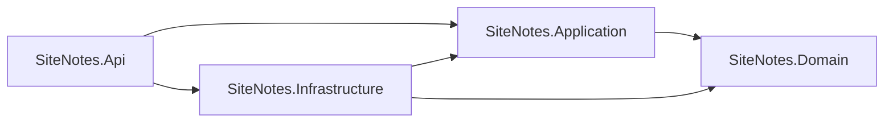

# Arquitetura e domínio do backend

O backend do SiteNotes segue Domain-Driven Design com domínio rico. A regra de negócio nasce na entidade, quando cabe nela, ou em um serviço, quando atravessa mais de um agregado. O projeto não usa o padrão handler (MediatR, `IRequestHandler`, command/query handler). Controller não decide regra e não fala com o banco.

O contrato HTTP mantém rotas, campos JSON e códigos de erro. A única mudança é que `id` e `referenceId` agora são números (`bigint`) gerados pelo PostgreSQL, em vez de strings hexadecimais.

## Bounded context

Há um único contexto, o caderno de referências. Ele guarda páginas que a pessoa leu ou assistiu e o diário de anotações de cada página.

A resolução do título de uma URL (HTML ou YouTube) fica no cliente: a extensão do navegador busca o título e o Angular envia `{ url, title }` pronto no `POST /api/references`. O backend só persiste.

## Camadas

A dependência aponta para dentro. Domínio não referencia aplicação, infraestrutura nem API.


```mermaid
flowchart LR
    Api[SiteNotes.Api]
    Application[SiteNotes.Application]
    Infrastructure[SiteNotes.Infrastructure]
    Domain[SiteNotes.Domain]

    Api --> Application
    Api --> Infrastructure
    Application --> Domain
    Infrastructure --> Application
    Infrastructure --> Domain
```

| Projeto | Responsabilidade |
| --- | --- |
| `SiteNotes.Domain` | Entidades, value objects, invariantes, serviço de domínio e portas de persistência |
| `SiteNotes.Application` | Casos de uso. Cada caso é um método de serviço. Traduz o resultado para DTO. Grava pela porta `IUnitOfWork`, sem referenciar o EF Core |
| `SiteNotes.Infrastructure` | PostgreSQL 17 via EF Core (Npgsql), migrations e relógio do sistema |
| `SiteNotes.Api` | Controllers, CORS, OpenAPI e tradução de exceção para HTTP |
| `SiteNotes.Tests` | xUnit sobre domínio e serviços de aplicação |

## Fluxo de uma requisição

1. O controller recebe o HTTP e chama um serviço de aplicação.
2. O serviço de aplicação carrega agregados pelos repositórios, chama comportamento do domínio e grava com `IUnitOfWork.SaveChangesAsync`. Quem implementa a porta é o próprio `SiteNotesDbContext`, que já é a unidade de trabalho do EF Core.
3. A infraestrutura persiste a própria entidade de domínio via EF Core, sem camada intermediária de documentos.
4. `ExceptionHandlingMiddleware` converte falha de regra em HTTP, no formato ProblemDetails (`application/problem+json`, RFC 9457).

| Exceção | HTTP | `title` | `detail` |
| --- | --- | --- | --- |
| `DomainException` | 400 | `Regra de negocio violada.` | mensagem da regra |
| `NotFoundException` | 404 | `Recurso nao encontrado.` | ausente |
| Qualquer outra | 500 | `Erro interno.` | ausente (o erro vai só para o log) |

Mensagens já usadas pela API:

- `Referencia invalida para a anotacao.`
- `Url e obrigatoria.`
- `Conteudo da anotacao nao pode ser vazio.`

## Onde a regra mora

| Tipo de regra | Onde fica | Exemplo |
| --- | --- | --- |
| Invariante de um agregado | Método da entidade | `Note.Revise` recusa conteúdo vazio |
| Conceito com regra própria | Value object | `Tag.Normalize` corta, ignora vazio e deduplica sem diferenciar maiúsculas |
| Regra que usa dois agregados | Serviço de domínio | `ReferenceNoteService.Add` cria a anotação e marca atividade na referência |
| Caso de uso, transação e DTO | Serviço de aplicação | `ReferenceService.CreateAsync` |
| Detalhe de banco ou rede | Infraestrutura | `ReferenceRepository`, `SystemClock` |

O serviço de aplicação orquestra. Ele não reimplementa a invariante. Se a regra cabe na entidade, o serviço só chama o método.

Não criar handler, command bus nem pasta `Features/Commands`. Um caso de uso novo é um método em um serviço já existente, ou um serviço novo quando o caso de uso é outro.

## Agregados e entidades

Os dois agregados são persistidos em tabelas separadas: `references` e `notes`, no banco PostgreSQL.

A anotação não fica dentro da lista em memória da referência. Listar o caderno não carrega o diário inteiro. O vínculo é o `ReferenceId` (chave estrangeira com `ON DELETE CASCADE`), e a regra que une os dois está em `ReferenceNoteService`.

### BaseEntity

Todas as entidades herdam de `BaseEntity` (`SiteNotes.Domain.Common`):

| Membro | Papel |
| --- | --- |
| `Id` (`long`) | Chave primária incremental gerada pelo banco (`GENERATED ALWAYS AS IDENTITY`). Vale `0` até o primeiro `SaveChanges` |
| `CreatedAt` | Instante de criação em UTC. Definido uma vez, em `InitializeTimestamps` |
| `UpdatedAt` | Instante da última alteração em UTC. Avança via `Touch` nos comportamentos da entidade |

Os setters são `protected`: só a própria entidade altera esses valores. O relógio continua injetado (`IClock`) e entra como parâmetro `utcNow` nos métodos de domínio, então o domínio nunca lê `DateTime.UtcNow`.

Como o `Id` só existe depois de persistir, regras que dependem dele (por exemplo, `Note.Create` exige `referenceId > 0`) só valem para entidades já salvas.

### Reference

Raiz do agregado de uma página salva.

| Membro | Papel |
| --- | --- |
| `Url` (`PageUrl`) | Endereço obrigatório, com espaços removidos |
| `Title` | Título exibido. Se vier vazio na criação, recebe a própria URL |
| `Tags` | Coleção de `Tag`, gravada na coluna `text[]` |
| `Id`, `CreatedAt`, `UpdatedAt` | Herdados de `BaseEntity` |

Comportamento:

- `Create` abre uma referência válida.
- `ChangeDetails` troca URL e título só quando o novo valor tem texto. Tags seguem a mesma ideia: `null` preserva as atuais, e uma lista (inclusive vazia) substitui as atuais, já normalizada.
- `RegisterActivity` avança `UpdatedAt` quando o diário dessa referência ganha uma anotação.
- `Matches` responde se a referência entra em uma busca por título/URL e em um filtro de tag.

`ReferenceSearch.Apply` filtra com `Matches` e ordena da atualização mais recente para a mais antiga. É a especificação da busca: o repositório EF reproduz a mesma regra em SQL e o repositório em memória dos testes usa `ReferenceSearch.Apply` diretamente.

### Note

Raiz do agregado de uma anotação.

| Membro | Papel |
| --- | --- |
| `ReferenceId` (`long`) | Referência dona da anotação |
| `Content` | Texto obrigatório, com espaços das pontas removidos |
| `Id`, `CreatedAt`, `UpdatedAt` | Herdados de `BaseEntity` |

Comportamento:

- `Create` exige conteúdo e uma referência válida (`ReferenceId > 0`).
- `Revise` troca o conteúdo e avança `UpdatedAt`. `CreatedAt` permanece.
- `ByMostRecent` ordena o diário da criação mais recente para a mais antiga (empate desfeito pelo `Id`). É o contrato de `INoteRepository.ListByReferenceAsync`: o repositório EF ordena no SQL, o repositório em memória dos testes usa `ByMostRecent`, e o serviço não reordena.

Editar ou apagar uma anotação não mexe no `UpdatedAt` da referência. Só a inclusão de uma anotação nova faz isso, via `ReferenceNoteService`.

Apagar a referência remove também as anotações dela. Quem garante isso é a chave estrangeira com `ON DELETE CASCADE`; `ReferenceService.DeleteAsync` só remove a referência.

## Value objects

| Tipo | Regra |
| --- | --- |
| `PageUrl` | Texto não vazio depois do trim. É o endereço guardado no caderno |
| `Tag` | Trim, descarte de vazio e unicidade sem diferenciar maiúsculas. A primeira grafia escrita é a que permanece |

## Serviço de domínio

`ReferenceNoteService` é o serviço de regra que cruza agregados:

1. Cria a `Note` com o id da `Reference`.
2. Chama `reference.RegisterActivity`.
3. Se o conteúdo for vazio, `Note.Create` falha antes de alterar a referência.

Não há outro serviço de domínio. Normalização de tag vive no value object `Tag`.

## Serviços de aplicação

| Serviço | Casos de uso |
| --- | --- |
| `IReferenceService` | Listar, obter, criar, atualizar e apagar referências; listar e incluir anotações de uma referência |
| `INoteService` | Obter, revisar e apagar uma anotação pelo id dela (`/api/notes/{id}`) |

`IClock` entra nos serviços que gravam data, para o teste controlar o instante.

A criação de referência espera `url` e `title` já resolvidos pelo cliente. Se o título vier vazio, o domínio usa a própria URL.

## Persistência

O domínio não referencia EF Core nem Npgsql. As entidades ricas (construtor privado, setters privados, campo `_tags`) são mapeadas diretamente pelo EF Core em `Persistence/Configurations`, com `IEntityTypeConfiguration`:

| Entidade | Tabela | Colunas |
| --- | --- | --- |
| `Reference` | `references` | `id` (identity), `url`, `title`, `tags` (`text[]`), `created_at`, `updated_at` |
| `Note` | `notes` | `id` (identity), `reference_id` (FK, cascade), `content`, `created_at`, `updated_at` |

- Convenção de nomes `snake_case` (`EFCore.NamingConventions`).
- `PageUrl` e `Tag` são convertidos por `ValueConverter` (texto e `text[]`).
- Datas usam `timestamp with time zone`, sempre em UTC.
- Os repositórios devolvem entidades rastreadas pelo EF: alterar a entidade e chamar `IUnitOfWork.SaveChangesAsync` basta, sem método `Update`.
- A porta `IUnitOfWork` (`SiteNotes.Application.Abstractions`) expõe só `SaveChangesAsync`. Não existe classe própria de unit of work: `SiteNotesDbContext` implementa a interface e `AddInfrastructure` registra o `SiteNotesDbContext` do escopo como `IUnitOfWork`. Assim a Application não conhece o EF Core e não consegue usar `Set<T>()` ou `Database` por acidente.
- A listagem de anotações filtra e ordena no SQL, por `reference_id` e `created_at`.
- A busca de referências (`IReferenceRepository.SearchAsync`) também roda no SQL: `ILIKE` em título e URL, `unnest(tags)` para a tag sem diferenciar maiúsculas e `ORDER BY updated_at DESC`, que usa o índice da coluna.

### Migrations

O esquema é versionado em `SiteNotes.Infrastructure/Persistence/Migrations`. Com `Database:ApplyMigrationsOnStartup=true` (ligado em `Development` e no Docker Compose) a API aplica as pendentes ao subir. Comandos no [README](../../README.md).

## API

Os controllers só delegam.

| Método | Rota | Serviço |
| --- | --- | --- |
| GET | `/api/references?search=&tag=` | `IReferenceService.ListAsync` |
| GET | `/api/references/{id}` | `IReferenceService.GetByIdAsync` |
| POST | `/api/references` | `IReferenceService.CreateAsync` |
| PUT | `/api/references/{id}` | `IReferenceService.UpdateAsync` |
| DELETE | `/api/references/{id}` | `IReferenceService.DeleteAsync` |
| GET | `/api/references/{id}/notes` | `IReferenceService.ListNotesAsync` |
| POST | `/api/references/{id}/notes` | `IReferenceService.AddNoteAsync` |
| GET | `/api/notes/{id}` | `INoteService.GetByIdAsync` |
| PUT | `/api/notes/{id}` | `INoteService.UpdateAsync` |
| DELETE | `/api/notes/{id}` | `INoteService.DeleteAsync` |

O registro de dependências está em `SiteNotes.Application.DependencyInjection.AddApplication` e `SiteNotes.Infrastructure.DependencyInjection.AddInfrastructure`. `Program.cs` chama os dois e mantém CORS e OpenAPI.

## Como acrescentar uma regra

Exemplo: impedir duas referências com a mesma URL.

1. Colocar a invariante no domínio. Se ela olha só uma referência, vira método ou value object. Se compara várias, vira método de serviço de domínio, por exemplo `ReferenceUniquenessService`, usando o repositório só se a porta já existir no domínio. Preferir receber as referências já carregadas e deixar a consulta no serviço de aplicação.
2. Chamar esse método a partir de `ReferenceService.CreateAsync` e `UpdateAsync`.
3. Lançar `DomainException` com a mensagem que a API deve devolver. O middleware já traduz para 400.
4. Cobrir a regra com um teste de domínio e o caso de uso com um teste do serviço, usando os repositórios em memória de `SiteNotes.Tests/Support`.
5. Não criar handler, request de mediator nem classe cujo único trabalho seja `Handle`.

Checklist rápido:

- A entidade herda de `BaseEntity` e protege o próprio estado (setters privados, fábrica `Create`).
- O serviço de aplicação abre e fecha a unidade de trabalho.
- O controller continua sem `DbContext` e sem `if` de regra.
- O teste da regra não sobe PostgreSQL nem HTTP.

## Testes

```powershell
dotnet test backend/SiteNotes.slnx
```

| Pasta | O que cobre |
| --- | --- |
| `Domain/Common` | `BaseEntity`: id, `CreatedAt` e `UpdatedAt` |
| `Domain/References` | Criação, tags, busca |
| `Domain/Notes` | Conteúdo, referência e ordenação |
| `Domain/Services` | `ReferenceNoteService` |
| `Application` | Casos de uso com repositório em memória e relógio falso |

Os testes não abrem conexão com o PostgreSQL. `Support/FakeUnitOfWork` implementa `IUnitOfWork` e só conta as chamadas a `SaveChangesAsync`, sem provider de banco. Os repositórios em memória simulam o id incremental do banco (`Support/DatabaseIdentity`). O cascade de exclusão e o mapeamento EF são validados subindo a API contra um PostgreSQL real (por exemplo, `docker compose up`).
