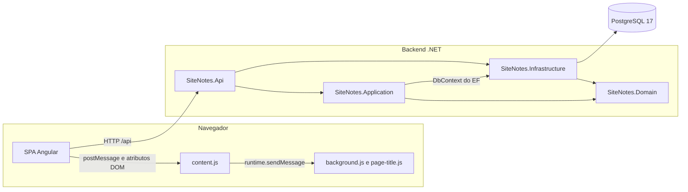

# Auditoria de código e arquitetura: problemas encontrados

Este documento lista as más práticas de código e os problemas de design e arquitetura encontrados no SiteNotes. Cada item tem um ID e a solução correspondente está em [02-solucoes.md](02-solucoes.md), na âncora de mesmo ID.

## Escopo

- Analisado: backend .NET (`backend/`), frontend Angular (`frontend/site-notes-app/`), extensão do navegador (`extension/`), Docker, Compose e higiene do repositório.
- Fora do escopo: segurança (autenticação, CORS, CSP, segredos, permissões da extensão). O app é local-first e esse tema foi deixado de lado de propósito.
- Os números de linha se referem ao estado do código no momento da auditoria (commit `71e2a15`).

## Legenda

| Severidade | Significado |
| --- | --- |
| Alta | Bug real, acoplamento que trava evolução ou custo recorrente relevante |
| Média | Má prática que aumenta o custo de manutenção ou esconde erros |
| Baixa | Ajuste de higiene, consistência ou clareza |

| Prefixo | Área |
| --- | --- |
| `BE` | Backend (.NET) |
| `FE` | Frontend (Angular) |
| `EXT` | Extensão do navegador |
| `OPS` | Docker, Compose, repositório e documentação |

## Visão geral da arquitetura atual



A seta `Application -> DbContext do EF` é o principal desvio de camadas (ver [BE-01](#be-01)). A extensão nunca fala com a API: ela só lista abas e resolve títulos para o Angular.

## Tabela-resumo

| ID | Título | Severidade | Categoria |
| --- | --- | --- | --- |
| [BE-01](#be-01) | Application depende do `DbContext` do EF Core | Alta | Arquitetura |
| [BE-02](#be-02) | Listagem carrega a tabela inteira e filtra em memória | Alta | Persistência |
| [BE-03](#be-03) | Healthcheck do Docker usa um endpoint de negócio | Alta | DevOps |
| [BE-04](#be-04) | `Location` do POST de nota aponta para a lista | Média | API |
| [BE-05](#be-05) | `tags: null` no update apaga todas as tags | Média | Domínio / API |
| [BE-06](#be-06) | Notas ordenadas duas vezes | Média | Código |
| [BE-07](#be-07) | Erros não seguem ProblemDetails | Média | API |
| [BE-08](#be-08) | Migrations no startup sem restrição de ambiente | Média | Persistência |
| [BE-09](#be-09) | `FakeDbContext` usa o provider Npgsql nos testes | Média | Testes |
| [BE-10](#be-10) | Lacunas de cobertura de testes | Média | Testes |
| [BE-11](#be-11) | Versões de pacotes EF desalinhadas | Média | Build |
| [BE-12](#be-12) | Sem `Directory.Build.props`, warnings como erro e analyzers | Média | Build |
| [BE-13](#be-13) | Documentação diverge do comportamento de tracking | Média | Documentação |
| [BE-14](#be-14) | Infrastructure referencia `Microsoft.AspNetCore.App` | Baixa | Arquitetura |
| [BE-15](#be-15) | Dependência de logging não usada na Application | Baixa | Build |
| [BE-16](#be-16) | Sem paginação nas listagens | Baixa | API |
| [BE-17](#be-17) | Configuração lida por strings mágicas | Baixa | Código |
| [BE-18](#be-18) | `ValueComparer` de tags não trata `null` | Baixa | Persistência |
| [BE-19](#be-19) | Mensagens de domínio duplicadas nos testes | Baixa | Código |
| [BE-20](#be-20) | Classes sem `sealed` e DTO com lista mutável | Baixa | Código |
| [FE-01](#fe-01) | Bug: `startsWith('fc')` bloqueia `facebook.com` | Alta | Bug |
| [FE-02](#fe-02) | URL da API fixa no código, sem environments | Alta | Configuração |
| [FE-03](#fe-03) | `ReferenceList` com responsabilidades demais | Alta | Arquitetura |
| [FE-04](#fe-04) | Subscriptions sem teardown | Alta | Estado |
| [FE-05](#fe-05) | Filtro dispara HTTP a cada tecla | Alta | HTTP |
| [FE-06](#fe-06) | `strict` implícito e sem `strictTemplates` | Alta | Tipagem |
| [FE-07](#fe-07) | Só existe um teste de fumaça | Alta | Testes |
| [FE-08](#fe-08) | Sem ESLint e sem scripts de lint/format | Média | Tooling |
| [FE-09](#fe-09) | Estado mistura signals, campos mutáveis e `subscribe` | Média | Estado |
| [FE-10](#fe-10) | Sem OnPush e com chamadas de método no template | Média | Change detection |
| [FE-11](#fe-11) | `setTimeout` do lookup não é limpo no destroy | Média | Memory leak |
| [FE-12](#fe-12) | Id da rota lido só via `snapshot` | Média | Routing |
| [FE-13](#fe-13) | `load()` do detalhe com loading frágil | Média | HTTP / estado |
| [FE-14](#fe-14) | Sem tratamento central de erros HTTP | Média | HTTP |
| [FE-15](#fe-15) | `findExistingReference` baixa todas as referências | Média | Performance |
| [FE-16](#fe-16) | Bridge da extensão ignora `error` e `requestId` | Média | Integração |
| [FE-17](#fe-17) | `ReferencesService.update` sem uso na interface | Média | Feature gap |
| [FE-18](#fe-18) | CSS duplicado entre lista e detalhe | Média | CSS |
| [FE-19](#fe-19) | Sem componentes de apresentação | Média | Arquitetura |
| [FE-20](#fe-20) | Acessibilidade do modal e dos inputs | Média | Acessibilidade |
| [FE-21](#fe-21) | Itens menores de consistência | Baixa | Código |
| [EXT-01](#ext-01) | Manifest híbrido `scripts` + `service_worker` | Média | MV3 |
| [EXT-02](#ext-02) | Lógica de URL e título duplicada com o frontend | Alta | Duplicação |
| [EXT-03](#ext-03) | Extensão sem build, tipos, lint e testes | Alta | Tooling |
| [EXT-04](#ext-04) | `fetch` sem timeout no service worker | Média | Resiliência |
| [EXT-05](#ext-05) | Porta fixa e critério inconsistente para achar o app | Média | Design |
| [EXT-06](#ext-06) | `sendRuntimeMessage` duplicado | Média | Duplicação |
| [EXT-07](#ext-07) | Reinjeção do `content.js` redeclara variáveis | Média | MV3 |
| [EXT-08](#ext-08) | Protocolo de mensagens sem contrato nem versão | Média | Design |
| [EXT-09](#ext-09) | Fallback MV2 e promise sem `.catch` no boot | Baixa | MV3 |
| [OPS-01](#ops-01) | `extension.zip` versionado | Alta | Repositório |
| [OPS-02](#ops-02) | Sem CI | Média | Repositório |
| [OPS-03](#ops-03) | Tags de imagem Docker não fixadas | Média | Docker |
| [OPS-04](#ops-04) | `.dockerignore` do backend inclui testes | Baixa | Docker |
| [OPS-05](#ops-05) | Ambiente contraditório entre Dockerfile e Compose | Baixa | Docker |
| [OPS-06](#ops-06) | Frontend espera a API ficar healthy sem precisar | Baixa | Compose |
| [OPS-07](#ops-07) | Sem `.editorconfig` na raiz e sem scripts do monorepo | Baixa | Repositório |
| [OPS-08](#ops-08) | README desatualizado | Baixa | Documentação |

---

## Backend

<a id="be-01"></a>
### BE-01 · Application depende do `DbContext` do EF Core (alta)

`backend/SiteNotes.Application/Notes/NoteService.cs` linhas 12-19 e `backend/SiteNotes.Application/References/ReferenceService.cs` linhas 15-28. O `.csproj` da Application referencia `Microsoft.EntityFrameworkCore` (linha 10).

```csharp
private readonly INoteRepository _notes;
private readonly DbContext _db;
private readonly IClock _clock;
```

Por que é um problema: a camada de casos de uso passa a conhecer o ORM. Os testes de aplicação precisam montar um `DbContext` real (ver [BE-09](#be-09)) e o `DbContext` injetado expõe muito mais do que `SaveChangesAsync` (`Set<T>()`, `Database`, change tracker), o que convida a usar o EF direto nos serviços. A decisão foi tomada de propósito (commit `903b4a2` e `backend/docs/arquitetura-e-dominio.md` linha 173), mas o custo aparece nos testes e na fronteira das camadas.

Solução: [02-solucoes.md#be-01](02-solucoes.md#be-01)

<a id="be-02"></a>
### BE-02 · Listagem carrega a tabela inteira e filtra em memória (alta)

`backend/SiteNotes.Infrastructure/Persistence/Repositories/ReferenceRepository.cs` linhas 18-19, `backend/SiteNotes.Application/References/ReferenceService.cs` linhas 33-42 e `backend/SiteNotes.Domain/References/ReferenceSearch.cs` linhas 5-8.

```csharp
public async Task<IReadOnlyList<Reference>> ListAsync(CancellationToken cancellationToken) =>
    await _db.References.AsNoTracking().ToListAsync(cancellationToken);
```

Por que é um problema: toda busca faz um full scan e filtra e ordena no processo. O índice em `updated_at` existe, mas nunca é usado porque não há `ORDER BY` no SQL. O custo cresce de forma linear com o caderno, e o frontend chama esse endpoint a cada tecla (ver [FE-05](#fe-05)).

Solução: [02-solucoes.md#be-02](02-solucoes.md#be-02)

<a id="be-03"></a>
### BE-03 · Healthcheck do Docker usa um endpoint de negócio (alta)

`backend/SiteNotes.Api/Dockerfile` linhas 36-37.

```dockerfile
HEALTHCHECK --interval=15s --timeout=5s --start-period=20s --retries=5 \
    CMD curl -fsS http://127.0.0.1:8080/api/references || exit 1
```

Por que é um problema: a cada 15 segundos o container lista todas as referências (e, por causa do [BE-02](#be-02), carrega a tabela inteira). A saúde do serviço fica acoplada a uma regra de negócio e não existe um endpoint leve de liveness.

Solução: [02-solucoes.md#be-03](02-solucoes.md#be-03)

<a id="be-04"></a>
### BE-04 · `Location` do POST de nota aponta para a lista (média)

`backend/SiteNotes.Api/Controllers/ReferencesController.cs` linhas 68-76.

```csharp
var note = await _references.AddNoteAsync(id, request, cancellationToken);
return CreatedAtAction(nameof(GetNotes), new { id }, note);
```

Por que é um problema: o `201 Created` devolve `Location: /api/references/{id}/notes` (a coleção), e não o recurso criado. O recurso já tem rota própria em `NotesController.GetById` (`/api/notes/{id}`).

Solução: [02-solucoes.md#be-04](02-solucoes.md#be-04)

<a id="be-05"></a>
### BE-05 · `tags: null` no update apaga todas as tags (média)

`backend/SiteNotes.Domain/References/Reference.cs` linhas 30-44.

```csharp
if (!string.IsNullOrWhiteSpace(url)) { Url = PageUrl.Create(url); }
if (!string.IsNullOrWhiteSpace(title)) { Title = title.Trim(); }
ReplaceTags(tags); // null vira lista vazia
```

Por que é um problema: `url` e `title` ausentes preservam o valor atual, mas `tags` ausente limpa a lista. Um cliente que envia só `{ "title": "novo" }` perde as tags sem perceber. O comportamento é assimétrico dentro do mesmo método.

Solução: [02-solucoes.md#be-05](02-solucoes.md#be-05)

<a id="be-06"></a>
### BE-06 · Notas ordenadas duas vezes (média)

`backend/SiteNotes.Infrastructure/Persistence/Repositories/NoteRepository.cs` linha 22 ordena no SQL e `backend/SiteNotes.Application/References/ReferenceService.cs` linha 80 ordena de novo com `Note.ByMostRecent`.

Por que é um problema: a porta `INoteRepository` não diz se a lista vem ordenada, então cada camada se protege por conta própria. É trabalho duplicado e deixa a regra "mais recente primeiro" sem um dono claro.

Solução: [02-solucoes.md#be-06](02-solucoes.md#be-06)

<a id="be-07"></a>
### BE-07 · Erros não seguem ProblemDetails (média)

`backend/SiteNotes.Api/ExceptionHandlingMiddleware.cs` linhas 23-51.

```csharp
context.Response.StatusCode = statusCode;
await context.Response.WriteAsJsonAsync(message); // corpo: "Url e obrigatoria."
```

Por que é um problema: o corpo do 400 é uma string JSON solta, o 404 sai sem corpo e o 500 é outra string. Não é o formato padrão do ASP.NET Core (`application/problem+json`, RFC 9457), então o cliente não tem um shape estável para ler `title`, `detail` e `status`.

Solução: [02-solucoes.md#be-07](02-solucoes.md#be-07)

<a id="be-08"></a>
### BE-08 · Migrations no startup sem restrição de ambiente (média)

`backend/SiteNotes.Api/Program.cs` linhas 31-36 e `docker-compose.yml` linha 40.

Por que é um problema: aplicar migrations ao subir é prático no uso local, mas a flag funciona em qualquer ambiente. Se alguém ligar a flag em `Production`, o boot passa a alterar o schema, e com mais de uma instância há corrida entre elas. Não há log indicando que as migrations foram aplicadas.

Solução: [02-solucoes.md#be-08](02-solucoes.md#be-08)

<a id="be-09"></a>
### BE-09 · `FakeDbContext` usa o provider Npgsql nos testes (média)

`backend/SiteNotes.Tests/Support/FakeDbContext.cs` linhas 5-21.

```csharp
: base(new DbContextOptionsBuilder<FakeDbContext>()
    .UseNpgsql("Host=localhost;Database=fake_only")
    .Options)
```

Por que é um problema: para contar chamadas a `SaveChangesAsync`, o teste de unidade carrega o provider do PostgreSQL inteiro. O fake existe só por causa do [BE-01](#be-01).

Solução: [02-solucoes.md#be-09](02-solucoes.md#be-09)

<a id="be-10"></a>
### BE-10 · Lacunas de cobertura de testes (média)

- `NoteService.GetByIdAsync` só é exercitado no caminho de erro (`backend/SiteNotes.Tests/Application/NoteServiceTests.cs` linha 70).
- O `ExceptionHandlingMiddleware` (400, 404, 500 e cancelamento) não tem teste.
- `InMemoryReferenceRepository.Remove` não remove as notas, então nenhum teste cobre a semântica de cascade que a aplicação promete.

Solução: [02-solucoes.md#be-10](02-solucoes.md#be-10)

<a id="be-11"></a>
### BE-11 · Versões de pacotes EF desalinhadas (média)

| Projeto | Pacote | Versão |
| --- | --- | --- |
| Application | `Microsoft.EntityFrameworkCore` | 10.0.4 |
| Application | `Microsoft.Extensions.*.Abstractions` | 10.0.4 |
| Api | `Microsoft.EntityFrameworkCore.Design` e `Microsoft.AspNetCore.OpenApi` | 10.0.12 |
| Infrastructure | `Npgsql.EntityFrameworkCore.PostgreSQL` | 10.0.3 |

Por que é um problema: o NuGet acaba unificando para a maior versão, mas cada `.csproj` declara uma diferente. Atualizar exige caçar versões em quatro arquivos, e o snapshot da migration registra 10.0.12.

Solução: [02-solucoes.md#be-11](02-solucoes.md#be-11)

<a id="be-12"></a>
### BE-12 · Sem `Directory.Build.props`, warnings como erro e analyzers (média)

Todos os `.csproj` repetem `TargetFramework`, `Nullable` e `ImplicitUsings`, e nenhum liga `TreatWarningsAsErrors`, `AnalysisLevel` ou `EnforceCodeStyleInBuild`.

Por que é um problema: warnings de nulabilidade e de analyzers não quebram o build, então se acumulam em silêncio. Configuração comum fica copiada em cinco arquivos.

Solução: [02-solucoes.md#be-12](02-solucoes.md#be-12)

<a id="be-13"></a>
### BE-13 · Documentação diverge do comportamento de tracking (média)

`backend/docs/arquitetura-e-dominio.md` linha 172 diz que "os repositórios devolvem entidades rastreadas pelo EF". Porém `ReferenceRepository.ListAsync` e `NoteRepository.ListByReferenceAsync` usam `AsNoTracking`.

Por que é um problema: quem seguir o documento e alterar uma entidade vinda de uma listagem vai chamar `SaveChangesAsync` e nada será persistido.

Solução: [02-solucoes.md#be-13](02-solucoes.md#be-13)

<a id="be-14"></a>
### BE-14 · Infrastructure referencia `Microsoft.AspNetCore.App` (baixa)

`backend/SiteNotes.Infrastructure/SiteNotes.Infrastructure.csproj` linhas 9-11.

Por que é um problema: a biblioteca de persistência puxa o shared framework web inteiro, quando só usa DI e Configuration. Isso amarra a Infrastructure a hosts ASP.NET.

Solução: [02-solucoes.md#be-14](02-solucoes.md#be-14)

<a id="be-15"></a>
### BE-15 · Dependência de logging não usada na Application (baixa)

`backend/SiteNotes.Application/SiteNotes.Application.csproj` linha 12 referencia `Microsoft.Extensions.Logging.Abstractions`, mas nenhum arquivo da Application usa `ILogger`.

Solução: [02-solucoes.md#be-15](02-solucoes.md#be-15)

<a id="be-16"></a>
### BE-16 · Sem paginação nas listagens (baixa)

`GET /api/references` e `GET /api/references/{id}/notes` devolvem tudo de uma vez (`ReferencesController.cs` linhas 18-26 e 61-66).

Por que é um problema: num caderno grande, a resposta e o render no Angular crescem sem limite. Não existe um teto de segurança nem um parâmetro de página.

Solução: [02-solucoes.md#be-16](02-solucoes.md#be-16)

<a id="be-17"></a>
### BE-17 · Configuração lida por strings mágicas (baixa)

`backend/SiteNotes.Api/Program.cs` linha 16 (`"Cors:AllowedOrigins"`) e linha 31 (`"Database:ApplyMigrationsOnStartup"`).

Por que é um problema: erros de digitação passam despercebidos, a configuração não é validada no boot e não há um tipo que documente as chaves disponíveis.

Solução: [02-solucoes.md#be-17](02-solucoes.md#be-17)

<a id="be-18"></a>
### BE-18 · `ValueComparer` de tags não trata `null` (baixa)

`backend/SiteNotes.Infrastructure/Persistence/Configurations/ReferenceConfiguration.cs` linhas 29-32.

```csharp
(left, right) => left!.SequenceEqual(right!),
```

Por que é um problema: o `!` só cala o compilador. Se o change tracker comparar um valor `null`, o resultado é `NullReferenceException`.

Solução: [02-solucoes.md#be-18](02-solucoes.md#be-18)

<a id="be-19"></a>
### BE-19 · Mensagens de domínio duplicadas nos testes (baixa)

As mensagens estão como literais em `Note.cs` (linhas 18 e 43) e `PageUrl.cs` (linha 18), e são repetidas como literais nos testes (por exemplo, `NoteServiceTests.cs` linha 57).

Por que é um problema: mudar o texto de uma mensagem quebra testes em vários lugares e não há um catálogo único dos erros que a API pode devolver.

Solução: [02-solucoes.md#be-19](02-solucoes.md#be-19)

<a id="be-20"></a>
### BE-20 · Classes sem `sealed` e DTO com lista mutável (baixa)

- `ReferencesController`, `NotesController`, `SiteNotesDbContext` e `DomainException` não são `sealed`, embora ninguém herde delas.
- `ReferenceDto.Tags` é `List<string>` (`ReferenceContracts.cs` linha 9), então quem recebe o DTO pode alterá-lo.

Solução: [02-solucoes.md#be-20](02-solucoes.md#be-20)

---

## Frontend

<a id="fe-01"></a>
### FE-01 · Bug: `startsWith('fc')` bloqueia `facebook.com` (alta)

`frontend/site-notes-app/src/app/core/utils/url.util.ts` linha 117. A mesma regra está em `extension/page-title.js` linha 118.

```ts
const lower = host.toLowerCase();
return lower.startsWith('fe80:') || lower.startsWith('fc') || lower.startsWith('fd');
```

Por que é um problema: a intenção é bloquear endereços IPv6 locais (`fc00::/7` e `fe80::/10`), mas o teste é feito sobre qualquer hostname. `facebook.com`, `fcc.gov`, `fdic.gov` e similares são tratados como host bloqueado, e o título nunca é resolvido. Além disso, `new URL('http://[fd00::1]').hostname` devolve `[fd00::1]`, com colchetes, então o caso IPv6 real também não é detectado.

Solução: [02-solucoes.md#fe-01](02-solucoes.md#fe-01)

<a id="fe-02"></a>
### FE-02 · URL da API fixa no código, sem environments (alta)

`frontend/site-notes-app/src/app/core/config/api.config.ts` linha 1.

```ts
export const API_BASE_URL = 'http://localhost:5210/api';
```

Por que é um problema: trocar a porta da API (por exemplo via `API_HOST_PORT` no `.env` do Compose) não chega ao frontend. A imagem Docker sai com o valor embutido no bundle e não há como sobrescrever sem rebuild.

Solução: [02-solucoes.md#fe-02](02-solucoes.md#fe-02)

<a id="fe-03"></a>
### FE-03 · `ReferenceList` com responsabilidades demais (alta)

`frontend/site-notes-app/src/app/references/reference-list/reference-list.ts` (311 linhas) e o template de 180 linhas.

O componente cuida de: listagem, filtros, ordenação, criação, detecção de duplicata, lookup de título com debounce, detecção da extensão, prompt de sessão, modal de abas e navegação. São 13 signals e 6 campos mutáveis.

Por que é um problema: é difícil testar uma parte sem montar todas, qualquer mudança no modal de abas mexe no arquivo da lista, e a lógica de orquestração não pode ser reaproveitada.

Solução: [02-solucoes.md#fe-03](02-solucoes.md#fe-03)

<a id="fe-04"></a>
### FE-04 · Subscriptions sem teardown (alta)

`reference-list.ts` linhas 79 e 154, e `reference-detail.ts` linhas 57, 62, 80, 109, 123 e 134.

```ts
this.referencesService.getAll(...).subscribe({
  next: (refs) => { this.references.set(refs); ... },
```

Por que é um problema: se o usuário sair da rota antes da resposta, o callback continua rodando e atualiza o estado de um componente destruído. Com requisições lentas, isso gera efeitos colaterais difíceis de reproduzir.

Solução: [02-solucoes.md#fe-04](02-solucoes.md#fe-04)

<a id="fe-05"></a>
### FE-05 · Filtro dispara HTTP a cada tecla (alta)

`reference-list.html` linhas 22-33 e `reference-list.ts` linhas 91-93.

```ts
onFilterChange(): void {
  this.load();
}
```

Por que é um problema: digitar "angular" gera 7 requisições. Como não há cancelamento, uma resposta antiga pode chegar depois da mais nova e sobrescrever a lista com um resultado errado (race condition).

Solução: [02-solucoes.md#fe-05](02-solucoes.md#fe-05)

<a id="fe-06"></a>
### FE-06 · `strict` implícito e sem `strictTemplates` (alta)

`frontend/site-notes-app/tsconfig.json` linhas 5-21.

Por que é um problema: o projeto depende do default do TypeScript 6 para `strict`, sem declarar no `tsconfig`. Se a versão mudar ou alguém copiar o arquivo, o modo estrito some sem aviso. Além disso, `strictTemplates` não está ligado, então o compilador não checa tipos dentro dos templates (bindings, `@if`, `@for`, eventos).

Solução: [02-solucoes.md#fe-06](02-solucoes.md#fe-06)

<a id="fe-07"></a>
### FE-07 · Só existe um teste de fumaça (alta)

O único spec é `src/app/app.spec.ts`, que verifica se o `App` é criado. Esse teste falha hoje (`ng test` sai com erro de injeção), porque o `ThemeService` chama `window.matchMedia`, que não existe no jsdom.

Por que é um problema: `url.util.ts` (regras de YouTube, URL canônica e hosts bloqueados), o bridge com a extensão e os serviços HTTP não têm teste. O bug do [FE-01](#fe-01) teria sido pego por um teste simples.

Solução: [02-solucoes.md#fe-07](02-solucoes.md#fe-07)

<a id="fe-08"></a>
### FE-08 · Sem ESLint e sem scripts de lint/format (média)

`frontend/site-notes-app/package.json` tem Prettier nas dependências e `.prettierrc` na pasta, mas não há script `format` nem `lint`, e o ESLint não está instalado.

Solução: [02-solucoes.md#fe-08](02-solucoes.md#fe-08)

<a id="fe-09"></a>
### FE-09 · Estado mistura signals, campos mutáveis e `subscribe` (média)

`reference-list.ts` linhas 27-55 e `reference-detail.ts` linhas 24-39. Parte do estado está em signals (`references`, `isLoading`) e parte em campos simples (`searchTerm`, `newUrl`, `editingNoteId`). As chamadas HTTP misturam `subscribe` e `firstValueFrom`.

Por que é um problema: num app zoneless (o projeto não tem `zone.js`), só signals garantem que a tela atualiza. Campos simples funcionam hoje porque vêm junto de eventos do template, mas isso é frágil.

Solução: [02-solucoes.md#fe-09](02-solucoes.md#fe-09)

<a id="fe-10"></a>
### FE-10 · Sem OnPush e com chamadas de método no template (média)

- Nenhum componente declara `changeDetection: ChangeDetectionStrategy.OnPush`.
- `reference-list.html` linha 96 chama `hostOf(reference.url)` a cada ciclo, e as linhas 136 e 140 leem o getter `filteredOpenTabs`, que refiltra a lista a cada ciclo.

Solução: [02-solucoes.md#fe-10](02-solucoes.md#fe-10)

<a id="fe-11"></a>
### FE-11 · `setTimeout` do lookup não é limpo no destroy (média)

`reference-list.ts` linhas 57 e 111-121.

Por que é um problema: se o usuário digitar uma URL e navegar em menos de 450 ms, o timer dispara depois do destroy e chama a extensão para resolver um título que ninguém vai ver.

Solução: [02-solucoes.md#fe-11](02-solucoes.md#fe-11)

<a id="fe-12"></a>
### FE-12 · Id da rota lido só via `snapshot` (média)

`reference-detail.ts` linhas 22 e 49-52.

```ts
private readonly referenceId = Number(this.route.snapshot.paramMap.get('id'));
```

Por que é um problema: `/references/abc` vira `NaN`, `load()` retorna em silêncio e a tela fica vazia, sem mensagem. E, se o router reaproveitar o componente ao navegar de `/references/1` para `/references/2`, o id não é atualizado.

Solução: [02-solucoes.md#fe-12](02-solucoes.md#fe-12)

<a id="fe-13"></a>
### FE-13 · `load()` do detalhe com loading frágil (média)

`reference-detail.ts` linhas 49-72. A referência e as notas são buscadas em duas subscriptions independentes, e só a de notas desliga o `isLoading`. Depois de adicionar, editar ou excluir uma nota, a tela recarrega a referência e todas as notas.

Por que é um problema: se a referência falhar e as notas responderem, a tela mostra o erro e as notas ao mesmo tempo. Cada operação custa duas requisições extras e pisca o "Carregando...".

Solução: [02-solucoes.md#fe-13](02-solucoes.md#fe-13)

<a id="fe-14"></a>
### FE-14 · Sem tratamento central de erros HTTP (média)

`src/app/app.config.ts` linha 10 usa `provideHttpClient()` sem interceptors. Cada `subscribe` define a própria mensagem genérica e descarta o erro (`error: () => ...`), então o texto que o backend devolve em 400 nunca chega ao usuário.

Solução: [02-solucoes.md#fe-14](02-solucoes.md#fe-14)

<a id="fe-15"></a>
### FE-15 · `findExistingReference` baixa todas as referências (média)

`reference-list.ts` linhas 301-310.

```ts
const known = await firstValueFrom(this.referencesService.getAll());
return known.find((reference) => canonicalReferenceUrl(reference.url) === canonical);
```

Por que é um problema: toda criação faz uma requisição extra que traz o caderno inteiro, mesmo quando a lista já está carregada na tela.

Solução: [02-solucoes.md#fe-15](02-solucoes.md#fe-15)

<a id="fe-16"></a>
### FE-16 · Bridge da extensão ignora `error` e `requestId` (média)

`src/app/core/services/browser-tabs.service.ts` linhas 102-109 e 134-145.

```ts
return !payload.requestId || payload.requestId === requestId;
```

Por que é um problema: uma resposta sem `requestId` é aceita por qualquer requisição pendente do mesmo tipo, então duas requisições simultâneas podem trocar respostas entre si. O campo `error` da resposta existe na interface, mas nunca é lido, e a promise resolve como se tivesse dado certo.

Solução: [02-solucoes.md#fe-16](02-solucoes.md#fe-16)

<a id="fe-17"></a>
### FE-17 · `ReferencesService.update` sem uso na interface (média)

`src/app/core/services/references.service.ts` linhas 33-35. O backend tem `PUT /api/references/{id}`, mas nenhuma tela permite editar título, URL ou tags depois de criar a referência.

Solução: [02-solucoes.md#fe-17](02-solucoes.md#fe-17)

<a id="fe-18"></a>
### FE-18 · CSS duplicado entre lista e detalhe (média)

`reference-list.css` e `reference-detail.css` repetem quase igual as regras de `.page`, `input`, `textarea`, `button`, `.secondary`, `.delete-btn`, `.tag`, `.sort-control`, `.error` e `.empty`.

Por que é um problema: ajustes visuais precisam ser feitos em dois lugares e acabam divergindo. O `reference-list.css` já estoura o budget de 4 kB por componente definido no `angular.json` (o build avisa: 4,36 kB).

Solução: [02-solucoes.md#fe-18](02-solucoes.md#fe-18)

<a id="fe-19"></a>
### FE-19 · Sem componentes de apresentação (média)

A aplicação tem só três componentes (`App`, `ReferenceList`, `ReferenceDetail`). Card de referência, lista de tags, controle de ordenação e modal de abas são blocos de template embutidos nas páginas, e o controle de ordenação aparece duplicado nas duas.

Solução: [02-solucoes.md#fe-19](02-solucoes.md#fe-19)

<a id="fe-20"></a>
### FE-20 · Acessibilidade do modal e dos inputs (média)

- `reference-list.html` linhas 115-117: o modal não tem `aria-modal="true"`, não recebe foco ao abrir, não prende o foco e não fecha com Escape.
- Os inputs da lista (linhas 22-33, 58-77 e 124-130) e o textarea do detalhe (linha 28) só têm `placeholder`, sem `label`.

Solução: [02-solucoes.md#fe-20](02-solucoes.md#fe-20)

<a id="fe-21"></a>
### FE-21 · Itens menores de consistência (baixa)

- `src/index.html` linha 2 declara `lang="en"`, mas a interface é em português.
- A chave `sitenotes.theme` e a lógica de tema aparecem no script inline do `index.html` (linhas 13-26) e no `theme.service.ts` (linhas 5 e 29-36).
- `CreateReferenceRequest` e `UpdateReferenceRequest` são idênticos (`reference.model.ts` linhas 10-20).
- `PageMetadata.source` é `string`, embora o código compare com valores fixos (`'fallback'`, `'blocked-host'`).
- `hostOf` (`reference-list.ts` linhas 99-105) duplica `hostTitleFromUrl` do `url.util.ts`.
- Números mágicos: 450 ms (`reference-list.ts` linha 120), 800 ms (`page-metadata.service.ts` linha 25) e 2500/4000/10000 ms (`browser-tabs.service.ts`).
- `window.confirm` nas exclusões, fora do padrão visual do app.
- `nginx.conf` linhas 15-19 aplicam `Cache-Control: immutable` a qualquer `.png` e `.ico`, inclusive arquivos sem hash no nome.

Solução: [02-solucoes.md#fe-21](02-solucoes.md#fe-21)

---

## Extensão

<a id="ext-01"></a>
### EXT-01 · Manifest híbrido `scripts` + `service_worker` (média)

`extension/manifest.json` linhas 18-21.

```json
"background": {
  "scripts": ["page-title.js", "background.js"],
  "service_worker": "background.js"
}
```

Por que é um problema: a mistura é intencional (o Firefox usa `scripts` e o Chrome usa `service_worker`), mas cada navegador emite aviso sobre a chave que não reconhece, e o carregamento do `page-title.js` depende de dois mecanismos diferentes (`scripts` no Firefox, `importScripts` no Chrome).

Solução: [02-solucoes.md#ext-01](02-solucoes.md#ext-01)

<a id="ext-02"></a>
### EXT-02 · Lógica de URL e título duplicada com o frontend (alta)

`extension/page-title.js` linhas 85-156 e 257-262 duplicam `frontend/site-notes-app/src/app/core/utils/url.util.ts` linhas 12-44, 73-75 e 86-121: extração do id do YouTube, hosts bloqueados e limpeza de título.

Por que é um problema: o bug do [FE-01](#fe-01) existe nos dois lugares, o que mostra o custo na prática. Qualquer regra nova precisa ser escrita duas vezes, em JavaScript e TypeScript.

Solução: [02-solucoes.md#ext-02](02-solucoes.md#ext-02)

<a id="ext-03"></a>
### EXT-03 · Extensão sem build, tipos, lint e testes (alta)

A pasta `extension/` tem só `.js`, `.html` e `.json`, sem `package.json`, sem checagem de tipos e sem testes.

Por que é um problema: o parsing de HTML e o protocolo de mensagens só são verificados manualmente no navegador. Não há onde rodar testes para a lógica de título.

Solução: [02-solucoes.md#ext-03](02-solucoes.md#ext-03)

<a id="ext-04"></a>
### EXT-04 · `fetch` sem timeout no service worker (média)

`extension/page-title.js` linhas 158-166 (oEmbed do YouTube) e 176-183 (HTML da página).

Por que é um problema: o Angular desiste depois de 10 segundos, mas o `fetch` continua pendurado no worker. Sites lentos mantêm o service worker ocupado e a requisição nunca é abortada.

Solução: [02-solucoes.md#ext-04](02-solucoes.md#ext-04)

<a id="ext-05"></a>
### EXT-05 · Porta fixa e critério inconsistente para achar o app (média)

- `extension/background.js` linha 6 fixa a porta `4200` para esconder o próprio app da lista de abas.
- `isSiteNotesUrl` (linhas 95-109) injeta o content script em qualquer porta de `localhost`, inclusive na API (`:5210`).
- `popup.html` linha 42 tem o link `http://localhost:4200` fixo.

Por que é um problema: são três critérios diferentes para a mesma pergunta ("esta aba é o SiteNotes?"). Mudar `FRONTEND_HOST_PORT` no Compose quebra a filtragem de abas.

Solução: [02-solucoes.md#ext-05](02-solucoes.md#ext-05)

<a id="ext-06"></a>
### EXT-06 · `sendRuntimeMessage` duplicado (média)

`extension/content.js` linhas 142-159 e `extension/popup.js` linhas 30-47 têm a mesma função.

Solução: [02-solucoes.md#ext-06](02-solucoes.md#ext-06)

<a id="ext-07"></a>
### EXT-07 · Reinjeção do `content.js` redeclara variáveis (média)

`extension/content.js` linhas 1-12 e `extension/background.js` linhas 133-152.

```js
const api = globalThis.browser ?? globalThis.chrome;
const SOURCE_APP = "sitenotes-app";
if (!globalThis.__sitenotesContentLoaded) { ... }
markPage();
let lastRequestId = null;
```

Por que é um problema: o `background.js` reinjeta o script a cada `onUpdated` da aba. Na segunda execução no mesmo mundo isolado, `const api` já existe e o script falha com `SyntaxError`. O erro é engolido pelo `catch` vazio de `injectContentScript`. O guard só protege `installBridge`, e não o arquivo inteiro.

Solução: [02-solucoes.md#ext-07](02-solucoes.md#ext-07)

<a id="ext-08"></a>
### EXT-08 · Protocolo de mensagens sem contrato nem versão (média)

Os tipos `PING`, `PONG`, `GET_OPEN_TABS`, `OPEN_TABS`, `RESOLVE_PAGE_TITLE` e `PAGE_TITLE`, e as fontes `sitenotes-app` e `sitenotes-extension`, são strings soltas em `content.js` (linhas 2-3 e 68-122) e em `browser-tabs.service.ts` (linhas 5-6 e 20-38).

Por que é um problema: não há um lugar único que defina o formato das mensagens. Uma extensão antiga com um app novo (ou o contrário) falha em silêncio, porque não existe número de versão.

Solução: [02-solucoes.md#ext-08](02-solucoes.md#ext-08)

<a id="ext-09"></a>
### EXT-09 · Fallback MV2 e promise sem `.catch` no boot (baixa)

- `extension/background.js` linhas 124-130 tentam `tabs.executeScript`, API do Manifest V2 que não existe no Chrome MV3. O Firefox moderno já tem `scripting.executeScript`.
- As linhas 145-151 chamam `api.tabs.query({}).then(...)` sem `.catch`, o que gera uma rejeição não tratada no boot do worker.

Solução: [02-solucoes.md#ext-09](02-solucoes.md#ext-09)

---

## Infra e repositório

<a id="ops-01"></a>
### OPS-01 · `extension.zip` versionado (alta)

`extension/extension.zip` está no Git e o `.gitignore` não cobre `*.zip` nem uma pasta de build da extensão. O histórico tem vários commits só para atualizar o zip (`a4e3493`, `fe8806c`).

Por que é um problema: o binário fica desatualizado em relação ao código-fonte sem que ninguém perceba, infla o histórico e gera commits sem diff legível.

Solução: [02-solucoes.md#ops-01](02-solucoes.md#ops-01)

<a id="ops-02"></a>
### OPS-02 · Sem CI (média)

Não há `.github/workflows` nem outro pipeline. `dotnet test`, o build do Angular e os testes do frontend só rodam se alguém lembrar.

Solução: [02-solucoes.md#ops-02](02-solucoes.md#ops-02)

<a id="ops-03"></a>
### OPS-03 · Tags de imagem Docker não fixadas (média)

`docker-compose.yml` linha 5 (`postgres:17`), `backend/SiteNotes.Api/Dockerfile` linhas 3 e 19 (`sdk:10.0`, `aspnet:10.0`) e `frontend/site-notes-app/Dockerfile` linhas 3 e 12 (`node:22-alpine`, `nginx:1.27-alpine`).

Por que é um problema: a mesma tag aponta para imagens diferentes ao longo do tempo, então o build de hoje pode não reproduzir o de ontem.

Solução: [02-solucoes.md#ops-03](02-solucoes.md#ops-03)

<a id="ops-04"></a>
### OPS-04 · `.dockerignore` do backend inclui testes (baixa)

`backend/.dockerignore` não exclui `SiteNotes.Tests/` nem `docs/`. Como o Dockerfile faz `COPY . ./`, o projeto de testes entra no contexto de build e invalida o cache sempre que um teste muda.

Solução: [02-solucoes.md#ops-04](02-solucoes.md#ops-04)

<a id="ops-05"></a>
### OPS-05 · Ambiente contraditório entre Dockerfile e Compose (baixa)

`backend/SiteNotes.Api/Dockerfile` linha 23 define `ASPNETCORE_ENVIRONMENT=Production` e `docker-compose.yml` linha 37 sobrescreve para `Development`. Quem lê só um dos arquivos tira a conclusão errada sobre o ambiente do container.

Solução: [02-solucoes.md#ops-05](02-solucoes.md#ops-05)

<a id="ops-06"></a>
### OPS-06 · Frontend espera a API ficar healthy sem precisar (baixa)

`docker-compose.yml` linhas 54-56. O frontend é um nginx servindo arquivos estáticos. Ele não precisa da API para subir, mas fica bloqueado até o healthcheck da API passar, e não sobe se a API falhar.

Solução: [02-solucoes.md#ops-06](02-solucoes.md#ops-06)

<a id="ops-07"></a>
### OPS-07 · Sem `.editorconfig` na raiz e sem scripts do monorepo (baixa)

Só `frontend/site-notes-app/.editorconfig` existe. O C# e a extensão não têm regras de indentação, charset e fim de linha. Também não há scripts na raiz para rodar testes de tudo ou empacotar a extensão.

Solução: [02-solucoes.md#ops-07](02-solucoes.md#ops-07)

<a id="ops-08"></a>
### OPS-08 · README desatualizado (baixa)

- A tabela de endpoints (linhas 152-164) não lista `GET /api/notes/{id}`.
- O README pede Node 20+ (linha 33), mas o Dockerfile do frontend usa Node 22 e o Angular 22 exige versões mais novas.
- O empacotamento da extensão não é explicado.

Solução: [02-solucoes.md#ops-08](02-solucoes.md#ops-08)

---

## Pontos positivos

O que já está bem feito e deve ser preservado:

- Domínio rico: entidades com construtor privado, fábricas `Create`, value objects (`PageUrl`, `Tag`) com igualdade e um serviço de domínio (`ReferenceNoteService`) para a regra entre agregados.
- O domínio não depende de nada e não lê `DateTime.UtcNow`: o relógio entra como parâmetro.
- `CancellationToken` propagado em todos os métodos assíncronos, sem `.Result` nem sync-over-async.
- Controllers magros, que só delegam.
- Testes de domínio claros e sem banco.
- Frontend com rotas lazy (`loadComponent`), serviços HTTP tipados e design tokens CSS com tema claro e escuro.
- Dockerfiles multi-stage, com restore separado para aproveitar cache.
- Compose com healthcheck do Postgres e `depends_on` condicionado.
