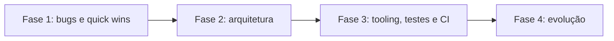

# Auditoria de código e arquitetura: soluções

Este documento traz a solução de cada problema listado em [01-problemas.md](01-problemas.md). Os IDs são os mesmos e cada item tem um link de volta para o problema.

Cada item informa:

- **Abordagem:** o que muda e por quê.
- **Esforço:** P (até 1 hora), M (algumas horas) ou G (um dia ou mais).
- **Depende de:** itens que precisam vir antes.
- **Status:** `Pendente` ou `Resolvido`. A implementação é feita com um commit por ID, com o ID no título do commit (por exemplo, `fix(BE-04): ...`), então `git log --grep BE-04` encontra a mudança.

---

## Backend

<a id="be-01"></a>
### BE-01 · Porta `IUnitOfWork` no lugar do `DbContext`

Problema: [01-problemas.md#be-01](01-problemas.md#be-01) · Esforço: M · Depende de: nenhum · **Status:** Resolvido

Abordagem: criar uma porta mínima na Application, implementada pelo próprio `SiteNotesDbContext`. Não é uma classe de unit of work própria (o motivo do commit `903b4a2` continua valendo): o `DbContext` segue sendo a unidade de trabalho, só que a Application enxerga apenas o método de que precisa. O pacote `Microsoft.EntityFrameworkCore` sai da Application.

```csharp
// SiteNotes.Application/Abstractions/IUnitOfWork.cs
public interface IUnitOfWork
{
    Task<int> SaveChangesAsync(CancellationToken cancellationToken = default);
}

// SiteNotes.Infrastructure
public sealed class SiteNotesDbContext : DbContext, IUnitOfWork { ... }
services.AddScoped<IUnitOfWork>(provider => provider.GetRequiredService<SiteNotesDbContext>());
```

<a id="be-02"></a>
### BE-02 · Filtro e ordenação no SQL

Problema: [01-problemas.md#be-02](01-problemas.md#be-02) · Esforço: M · Depende de: nenhum · **Status:** Resolvido

Abordagem: trocar `ListAsync()` por `SearchAsync(search, tag)` na porta `IReferenceRepository`. A implementação EF usa `ILIKE` para título e URL, `unnest(tags)` para a tag (sem diferenciar maiúsculas) e `ORDER BY updated_at DESC`, que aproveita o índice existente. O repositório em memória dos testes continua usando `ReferenceSearch.Apply`, que vira a especificação executável da regra. Um teste valida a tradução com `ToQueryString()`, sem precisar de banco.

```csharp
var query = string.IsNullOrWhiteSpace(tag)
    ? _db.References.AsQueryable()
    : _db.References.FromSql($"""SELECT * FROM "references" WHERE EXISTS (SELECT 1 FROM unnest(tags) AS t(value) WHERE lower(t.value) = lower({tag}))""");

if (!string.IsNullOrWhiteSpace(search))
{
    var pattern = $"%{EscapeLike(search.Trim())}%";
    query = query.Where(r => EF.Functions.ILike(r.Title, pattern) || EF.Functions.ILike((string)(object)r.Url, pattern));
}

return await query.AsNoTracking().OrderByDescending(r => r.UpdatedAt).ToListAsync(ct);
```

<a id="be-03"></a>
### BE-03 · Endpoint `/health`

Problema: [01-problemas.md#be-03](01-problemas.md#be-03) · Esforço: P · Depende de: nenhum · **Status:** Resolvido

Abordagem: `AddHealthChecks().AddDbContextCheck<SiteNotesDbContext>()` e `MapHealthChecks("/health")`. A checagem só abre a conexão (`CanConnectAsync`), sem consultar tabelas. O `HEALTHCHECK` do Dockerfile passa a chamar `/health`.

<a id="be-04"></a>
### BE-04 · `CreatedAtAction` apontando para `NotesController.GetById`

Problema: [01-problemas.md#be-04](01-problemas.md#be-04) · Esforço: P · Depende de: nenhum · **Status:** Resolvido

```csharp
return CreatedAtAction(nameof(NotesController.GetById), "Notes", new { id = note.Id }, note);
```

<a id="be-05"></a>
### BE-05 · `tags: null` preserva as tags

Problema: [01-problemas.md#be-05](01-problemas.md#be-05) · Esforço: P · Depende de: nenhum · **Status:** Resolvido

Abordagem: seguir a mesma regra de `url` e `title`: valor ausente preserva o atual. Para limpar as tags, o cliente envia `[]`.

```csharp
if (tags is not null)
{
    ReplaceTags(tags);
}
```

<a id="be-06"></a>
### BE-06 · Ordenação de notas com um dono só

Problema: [01-problemas.md#be-06](01-problemas.md#be-06) · Esforço: P · Depende de: nenhum · **Status:** Resolvido

Abordagem: a porta `INoteRepository.ListByReferenceAsync` passa a documentar que devolve da mais recente para a mais antiga. O SQL continua ordenando e o serviço deixa de reordenar. O repositório em memória usa `Note.ByMostRecent` para cumprir o mesmo contrato.

<a id="be-07"></a>
### BE-07 · Erros como ProblemDetails

Problema: [01-problemas.md#be-07](01-problemas.md#be-07) · Esforço: P · Depende de: nenhum · **Status:** Resolvido

Abordagem: registrar `AddProblemDetails()` e fazer o middleware escrever via `IProblemDetailsService`. O 400 leva a mensagem da regra em `detail`, o 404 ganha corpo e o 500 continua sem detalhes internos.

```json
{ "type": "...", "title": "Regra de negócio violada", "status": 400, "detail": "Url e obrigatoria." }
```

<a id="be-08"></a>
### BE-08 · Migrations no startup só em Development

Problema: [01-problemas.md#be-08](01-problemas.md#be-08) · Esforço: P · Depende de: nenhum · **Status:** Resolvido

Abordagem: aplicar as migrations só quando a flag estiver ligada e o ambiente for `Development`. Em outro ambiente com a flag ligada, a API registra um aviso e não aplica nada. A aplicação das migrations passa a ser registrada no log. O Compose já roda em `Development`, então nada muda no uso local.

<a id="be-09"></a>
### BE-09 · Testes sem `DbContext`

Problema: [01-problemas.md#be-09](01-problemas.md#be-09) · Esforço: P · Depende de: [BE-01](#be-01) · **Status:** Resolvido

Abordagem: com a porta `IUnitOfWork`, o `FakeDbContext` vira um `FakeUnitOfWork` que só conta chamadas, sem provider de banco. No commit do BE-01 o `FakeDbContext` apenas passa a implementar `IUnitOfWork`, para os testes continuarem compilando; a troca acontece aqui.

<a id="be-10"></a>
### BE-10 · Testes que faltam

Problema: [01-problemas.md#be-10](01-problemas.md#be-10) · Esforço: M · Depende de: [BE-07](#be-07) · **Status:** Resolvido

Abordagem:

- Teste do caminho feliz de `NoteService.GetByIdAsync`.
- Testes do `ExceptionHandlingMiddleware` com `DefaultHttpContext`: 400 com `detail`, 404, 500 sem vazar a mensagem interna e cancelamento repassado.
- O repositório de referências em memória passa a apagar as notas da referência removida, imitando o `ON DELETE CASCADE`, e um teste verifica isso no serviço.

<a id="be-11"></a>
### BE-11 · Central Package Management

Problema: [01-problemas.md#be-11](01-problemas.md#be-11) · Esforço: P · Depende de: [BE-01](#be-01) · **Status:** Resolvido

Abordagem: `backend/Directory.Packages.props` com `ManagePackageVersionsCentrally` e uma única versão por pacote. Os pacotes `Microsoft.*` ficam alinhados na mesma versão de patch, e os `.csproj` passam a declarar só o nome do pacote.

<a id="be-12"></a>
### BE-12 · `Directory.Build.props` com warnings como erro

Problema: [01-problemas.md#be-12](01-problemas.md#be-12) · Esforço: P · Depende de: [BE-11](#be-11) · **Status:** Resolvido

```xml
<Project>
  <PropertyGroup>
    <TargetFramework>net10.0</TargetFramework>
    <Nullable>enable</Nullable>
    <ImplicitUsings>enable</ImplicitUsings>
    <TreatWarningsAsErrors>true</TreatWarningsAsErrors>
    <AnalysisLevel>latest</AnalysisLevel>
    <EnforceCodeStyleInBuild>true</EnforceCodeStyleInBuild>
  </PropertyGroup>
</Project>
```

<a id="be-13"></a>
### BE-13 · Documentação de tracking corrigida

Problema: [01-problemas.md#be-13](01-problemas.md#be-13) · Esforço: P · Depende de: nenhum · **Status:** Resolvido

Abordagem: corrigir `backend/docs/arquitetura-e-dominio.md`: `GetByIdAsync` devolve entidade rastreada (para comandos) e as listagens usam `AsNoTracking` (só leitura).

<a id="be-14"></a>
### BE-14 · Infrastructure sem o shared framework web

Problema: [01-problemas.md#be-14](01-problemas.md#be-14) · Esforço: P · Depende de: [BE-03](#be-03) · **Status:** Resolvido

Abordagem: trocar o `FrameworkReference` por `Microsoft.Extensions.Configuration.Abstractions` (o EF já traz a abstração de DI). O health check do EF fica registrado na Api.

<a id="be-15"></a>
### BE-15 · Remover `Logging.Abstractions` da Application

Problema: [01-problemas.md#be-15](01-problemas.md#be-15) · Esforço: P · Depende de: nenhum · **Status:** Resolvido

<a id="be-16"></a>
### BE-16 · Paginação opcional

Problema: [01-problemas.md#be-16](01-problemas.md#be-16) · Esforço: M · Depende de: [BE-02](#be-02) · **Status:** Pendente

Abordagem: parâmetros opcionais `skip` e `take` em `GET /api/references` e `GET /api/references/{id}/notes`. Sem os parâmetros, o comportamento atual é mantido (sem quebrar o frontend). `take` é limitado a 200 e valores inválidos geram 400. O versionamento de rota (`/api/v1`) fica para quando houver um segundo cliente.

<a id="be-17"></a>
### BE-17 · Options pattern

Problema: [01-problemas.md#be-17](01-problemas.md#be-17) · Esforço: P · Depende de: [BE-08](#be-08) · **Status:** Resolvido

Abordagem: classes `DatabaseOptions` e `CorsOptions` com `BindConfiguration(...)` e `ValidateOnStart()`. O nome da seção fica numa constante da própria classe.

Implementado: a classe de CORS se chama `FrontendCorsOptions` para não colidir com `Microsoft.AspNetCore.Cors.Infrastructure.CorsOptions`. A lista de origens precisa ter pelo menos um item e só aceita URLs http(s) absolutas.

<a id="be-18"></a>
### BE-18 · `ValueComparer` nulo-seguro

Problema: [01-problemas.md#be-18](01-problemas.md#be-18) · Esforço: P · Depende de: nenhum · **Status:** Pendente

```csharp
(left, right) => ReferenceEquals(left, right) || (left != null && right != null && left.SequenceEqual(right)),
tags => tags == null ? 0 : tags.Aggregate(0, (hash, tag) => HashCode.Combine(hash, tag.GetHashCode())),
```

<a id="be-19"></a>
### BE-19 · Catálogo `DomainErrors`

Problema: [01-problemas.md#be-19](01-problemas.md#be-19) · Esforço: P · Depende de: nenhum · **Status:** Pendente

Abordagem: `SiteNotes.Domain/Common/DomainErrors.cs` com as mensagens em constantes. Domínio e testes usam as constantes.

<a id="be-20"></a>
### BE-20 · `sealed` e DTO imutável

Problema: [01-problemas.md#be-20](01-problemas.md#be-20) · Esforço: P · Depende de: [BE-01](#be-01) · **Status:** Pendente

Abordagem: marcar como `sealed` os controllers, o `SiteNotesDbContext` e a `DomainException`, e trocar `ReferenceDto.Tags` para `IReadOnlyList<string>`. O JSON não muda.

---

## Frontend

<a id="fe-01"></a>
### FE-01 · Detecção de IPv6 local só para literais IPv6

Problema: [01-problemas.md#fe-01](01-problemas.md#fe-01) · Esforço: P · Depende de: nenhum · **Status:** Resolvido

Abordagem: tirar os colchetes do hostname e só aplicar os prefixos `fc`, `fd` e `fe80` quando o host contém `:` (ou seja, é um literal IPv6). A correção é aplicada também em `extension/page-title.js`, que tem a mesma regra.

```ts
const host = url.hostname.replace(/^\[|\]$/g, '').toLowerCase();
if (host.includes(':')) {
  return host === '::1' || host.startsWith('fc') || host.startsWith('fd') || host.startsWith('fe80:');
}
```

<a id="fe-02"></a>
### FE-02 · Environments e URL da API configurável

Problema: [01-problemas.md#fe-02](01-problemas.md#fe-02) · Esforço: P · Depende de: nenhum · **Status:** Resolvido

Abordagem: `src/environments/environment.ts` com `apiBaseUrl` e `environment.development.ts` via `fileReplacements`. O `API_BASE_URL` passa a ler do environment. O Dockerfile recebe `ARG API_BASE_URL` e grava o valor no environment antes do build, e o Compose passa `http://localhost:${API_HOST_PORT}/api`.

<a id="fe-03"></a>
### FE-03 · Quebrar `ReferenceList`

Problema: [01-problemas.md#fe-03](01-problemas.md#fe-03) · Esforço: G · Depende de: [FE-04](#fe-04), [FE-05](#fe-05) e [FE-11](#fe-11) · **Status:** Resolvido

Abordagem: separar em:

- `TabPicker`: o modal de abas (inputs: abas, carregando, erro; outputs: escolher, fechar).
- `AddReferenceForm`: o formulário de novo site, com o lookup de título.
- `ReferenceCreator`: um serviço que concentra a criação (resolver título, detectar duplicata, criar e navegar), usado pela lista e pelo picker.

A página `ReferenceList` passa a só orquestrar.

Na execução, o `ReferenceCreator` rejeita a promise quando a criação falha, e cada tela mostra a sua mensagem. Se a busca de duplicatas falhar, ele segue com a criação em vez de olhar a lista em memória da página. O [FE-15](#fe-15) troca essa busca por uma consulta filtrada.

<a id="fe-04"></a>
### FE-04 · `takeUntilDestroyed` em todas as subscriptions

Problema: [01-problemas.md#fe-04](01-problemas.md#fe-04) · Esforço: P · Depende de: nenhum · **Status:** Resolvido

```ts
private readonly destroyRef = inject(DestroyRef);

this.referencesService.getAll(...)
  .pipe(takeUntilDestroyed(this.destroyRef))
  .subscribe(...);
```

<a id="fe-05"></a>
### FE-05 · Debounce e `switchMap` no filtro

Problema: [01-problemas.md#fe-05](01-problemas.md#fe-05) · Esforço: P · Depende de: [FE-04](#fe-04) · **Status:** Resolvido

Abordagem: um `Subject` de recargas com `debounce` de 300 ms (só para digitação) e `switchMap`. O `switchMap` cancela a requisição anterior, então uma resposta antiga nunca sobrescreve a nova. Recargas explícitas (depois de excluir, por exemplo) passam pelo mesmo fluxo, sem debounce.

<a id="fe-06"></a>
### FE-06 · `strict` explícito e `strictTemplates`

Problema: [01-problemas.md#fe-06](01-problemas.md#fe-06) · Esforço: P · Depende de: nenhum · **Status:** Resolvido

```json
"compilerOptions": { "strict": true, ... },
"angularCompilerOptions": { "strictTemplates": true, ... }
```

<a id="fe-07"></a>
### FE-07 · Testes de unidade do frontend

Problema: [01-problemas.md#fe-07](01-problemas.md#fe-07) · Esforço: M · Depende de: [FE-01](#fe-01) e [FE-16](#fe-16) · **Status:** Resolvido

Abordagem: corrigir o `app.spec.ts` (stub de `matchMedia` no setup) e adicionar specs para `url.util.ts` (YouTube, URL canônica, hosts bloqueados, incluindo o caso `facebook.com`), `BrowserTabsService` (resposta certa, `requestId` diferente, `error`, timeout) e `ReferencesService` (com `HttpTestingController`).

Na execução, o spec de `canonicalReferenceUrl` revelou que a barra final só era removida quando a URL não tinha query string (`/post/?id=7` e `/post?id=7` viravam referências diferentes). A correção, que passa a ajustar o `pathname`, entrou no mesmo commit.

<a id="fe-08"></a>
### FE-08 · ESLint e scripts de lint/format

Problema: [01-problemas.md#fe-08](01-problemas.md#fe-08) · Esforço: P · Depende de: nenhum · **Status:** Resolvido

Abordagem: `angular-eslint` com configuração flat (`eslint.config.js`) e scripts `lint`, `format` e `format:check` no `package.json`.

<a id="fe-09"></a>
### FE-09 · Estado de formulário em signals

Problema: [01-problemas.md#fe-09](01-problemas.md#fe-09) · Esforço: M · Depende de: [FE-03](#fe-03) · **Status:** Pendente

Abordagem: trocar os campos mutáveis (`searchTerm`, `tagFilter`, `newUrl`, `editingNoteId` e outros) por signals ligados aos inputs com `[ngModel]`/`(ngModelChange)` ou `model()`. Todas as chamadas HTTP passam a usar `Observable` com `takeUntilDestroyed` ou `firstValueFrom`, sem misturar estilos no mesmo componente.

<a id="fe-10"></a>
### FE-10 · OnPush e `computed` no lugar de métodos no template

Problema: [01-problemas.md#fe-10](01-problemas.md#fe-10) · Esforço: P · Depende de: [FE-09](#fe-09) · **Status:** Pendente

Abordagem: `ChangeDetectionStrategy.OnPush` em todos os componentes, `filteredOpenTabs` como `computed` e o host da URL pré-calculado num `computed` da lista (sem `hostOf()` no template).

<a id="fe-11"></a>
### FE-11 · Limpar o timer no destroy

Problema: [01-problemas.md#fe-11](01-problemas.md#fe-11) · Esforço: P · Depende de: nenhum · **Status:** Resolvido

```ts
this.destroyRef.onDestroy(() => this.cancelTitleLookup());
```

<a id="fe-12"></a>
### FE-12 · Id da rota reativo e validado

Problema: [01-problemas.md#fe-12](01-problemas.md#fe-12) · Esforço: P · Depende de: [FE-13](#fe-13) · **Status:** Pendente

Abordagem: ler o id de `route.paramMap` como Observable, validar (`Number.isInteger` e maior que zero) e mostrar "Referencia nao encontrada." quando inválido. Uma troca de id recarrega os dados.

<a id="fe-13"></a>
### FE-13 · Carregamento único com `forkJoin` e atualização local

Problema: [01-problemas.md#fe-13](01-problemas.md#fe-13) · Esforço: P · Depende de: [FE-04](#fe-04) · **Status:** Pendente

Abordagem: buscar referência e notas com `forkJoin` (um único `isLoading`, um único erro). Adicionar, editar e excluir uma nota atualizam o signal `notes` com a resposta da API, sem recarregar a tela.

<a id="fe-14"></a>
### FE-14 · Mensagem de erro da API

Problema: [01-problemas.md#fe-14](01-problemas.md#fe-14) · Esforço: P · Depende de: [BE-07](#be-07) · **Status:** Pendente

Abordagem: uma função `apiErrorMessage(error, fallback)` que lê o `detail` do ProblemDetails (ou mostra a mensagem de API fora do ar quando `status === 0`). Os componentes passam a usar essa função no lugar das mensagens fixas. Um interceptor HTTP foi considerado, mas sem toast global ele só adicionaria indireção.

<a id="fe-15"></a>
### FE-15 · Detecção de duplicata sem baixar o caderno

Problema: [01-problemas.md#fe-15](01-problemas.md#fe-15) · Esforço: P · Depende de: [FE-03](#fe-03) · **Status:** Pendente

Abordagem: buscar só os candidatos com `GET /api/references?search=<host>` (o filtro roda no SQL desde o [BE-02](#be-02)) e comparar a URL canônica no cliente.

<a id="fe-16"></a>
### FE-16 · Bridge exige `requestId` e trata `error`

Problema: [01-problemas.md#fe-16](01-problemas.md#fe-16) · Esforço: P · Depende de: nenhum · **Status:** Resolvido

Abordagem: aceitar só respostas com o mesmo `requestId` (a extensão já devolve o id em todas as respostas) e rejeitar a promise quando a resposta de abas traz `error`. Na resolução de título, o `error` não derruba o fluxo, porque a extensão já manda um título de fallback.

<a id="fe-17"></a>
### FE-17 · Edição da referência no detalhe

Problema: [01-problemas.md#fe-17](01-problemas.md#fe-17) · Esforço: M · Depende de: [FE-13](#fe-13) e [BE-05](#be-05) · **Status:** Pendente

Abordagem: um botão "Editar" no cabeçalho do detalhe abre um formulário com título, URL e tags, que chama `ReferencesService.update`.

<a id="fe-18"></a>
### FE-18 · Primitivas de UI no CSS global

Problema: [01-problemas.md#fe-18](01-problemas.md#fe-18) · Esforço: P · Depende de: nenhum · **Status:** Resolvido

Abordagem: mover para `styles.css` as regras repetidas (`.page`, campos, botões, `.secondary`, `.delete-btn`, `.sort-control`, `.tag`, `.error`, `.empty`). Os CSS dos componentes ficam só com o layout específico, e o budget volta a passar.

Na execução, este item foi antecipado para antes do [FE-03](#fe-03): com as primitivas no CSS global, os componentes extraídos no FE-03 e no FE-19 não precisam copiar estilos de botão e campo.

<a id="fe-19"></a>
### FE-19 · Componentes de apresentação

Problema: [01-problemas.md#fe-19](01-problemas.md#fe-19) · Esforço: M · Depende de: [FE-03](#fe-03) · **Status:** Resolvido

Abordagem: `shared/ui` com `SortToggle` (usado nas duas páginas), `TagList` e `ReferenceCard`, todos com `input()` e `output()` e sem injetar serviços.

<a id="fe-20"></a>
### FE-20 · Modal e campos acessíveis

Problema: [01-problemas.md#fe-20](01-problemas.md#fe-20) · Esforço: P · Depende de: [FE-03](#fe-03) · **Status:** Resolvido

Abordagem: `aria-modal="true"`, foco no campo de busca ao abrir, Escape para fechar, retorno do foco ao elemento anterior e Tab preso dentro do modal. Os campos ganham `label` (visível ou com a classe `sr-only`).

<a id="fe-21"></a>
### FE-21 · Itens menores

Problema: [01-problemas.md#fe-21](01-problemas.md#fe-21) · Esforço: P · Depende de: [FE-03](#fe-03) · **Status:** Pendente

Abordagem:

- `lang="pt-BR"` no `index.html`.
- Comentário no script inline do tema apontando para `THEME_STORAGE_KEY` (o script precisa ficar inline para evitar o flash de tema).
- `UpdateReferenceRequest` como alias de `CreateReferenceRequest`.
- `PageMetadata.source` como união de literais.
- Remover `hostOf` em favor de `hostTitleFromUrl`.
- Constantes nomeadas para os timeouts.
- `nginx.conf`: `immutable` só para JS e CSS com hash; demais assets com cache curto.
- `window.confirm` é mantido por enquanto: trocar por um diálogo próprio entra junto com um componente de diálogo genérico, fora deste escopo.

---

## Extensão

<a id="ext-01"></a>
### EXT-01 · Um manifest por navegador

Problema: [01-problemas.md#ext-01](01-problemas.md#ext-01) · Esforço: P · Depende de: [EXT-03](#ext-03) · **Status:** Pendente

Abordagem: o build gera `dist/chrome` (só `service_worker`) e `dist/firefox` (só `scripts`) a partir de um manifest base e de um ajuste por navegador.

<a id="ext-02"></a>
### EXT-02 · Regras de URL compartilhadas

Problema: [01-problemas.md#ext-02](01-problemas.md#ext-02) · Esforço: M · Depende de: [EXT-03](#ext-03) · **Status:** Resolvido

Abordagem: uma pasta `shared/` na raiz com as regras de URL em TypeScript (`url-rules.ts`: id do YouTube, hosts bloqueados, limpeza de título). O Angular importa direto e o build da extensão empacota o mesmo arquivo.

<a id="ext-03"></a>
### EXT-03 · Build, tipos, lint e testes na extensão

Problema: [01-problemas.md#ext-03](01-problemas.md#ext-03) · Esforço: M · Depende de: nenhum · **Status:** Resolvido

Abordagem: `extension/package.json` com TypeScript, esbuild, ESLint e Vitest. Os fontes vão para `extension/src/*.ts`, o build gera `extension/dist/` (fora do Git) e há testes para a resolução de título. A extensão passa a ser carregada a partir de `extension/dist/...`.

<a id="ext-04"></a>
### EXT-04 · Timeout nos `fetch`

Problema: [01-problemas.md#ext-04](01-problemas.md#ext-04) · Esforço: P · Depende de: nenhum · **Status:** Resolvido

```js
const response = await fetch(url, { signal: AbortSignal.timeout(PAGE_TITLE_FETCH_TIMEOUT_MS), ... });
```

<a id="ext-05"></a>
### EXT-05 · Um único critério para reconhecer o app

Problema: [01-problemas.md#ext-05](01-problemas.md#ext-05) · Esforço: P · Depende de: [EXT-03](#ext-03) · **Status:** Pendente

Abordagem: uma função `isSiteNotesAppUrl` e uma lista `SITE_NOTES_APP_PORTS` usadas tanto para injetar o content script quanto para esconder o app da lista de abas. O link do popup usa a primeira porta da lista.

<a id="ext-06"></a>
### EXT-06 · `sendRuntimeMessage` em um módulo

Problema: [01-problemas.md#ext-06](01-problemas.md#ext-06) · Esforço: P · Depende de: [EXT-03](#ext-03) · **Status:** Pendente

Abordagem: `src/messaging.ts`, importado pelo content script e pelo popup.

<a id="ext-07"></a>
### EXT-07 · Guard cobrindo o script inteiro

Problema: [01-problemas.md#ext-07](01-problemas.md#ext-07) · Esforço: P · Depende de: nenhum · **Status:** Resolvido

Abordagem: envolver o `content.js` numa IIFE que sai cedo quando `__sitenotesContentLoaded` já está marcado. Assim a reinjeção não redeclara nada e só reafirma o atributo `data-sitenotes-ext`.

<a id="ext-08"></a>
### EXT-08 · Contrato de mensagens versionado

Problema: [01-problemas.md#ext-08](01-problemas.md#ext-08) · Esforço: P · Depende de: [EXT-02](#ext-02) · **Status:** Resolvido

Abordagem: `shared/bridge-protocol.ts` com as fontes, os tipos de mensagem, as interfaces de payload e `BRIDGE_PROTOCOL_VERSION`. App e extensão importam o mesmo arquivo e enviam a versão em toda mensagem.

<a id="ext-09"></a>
### EXT-09 · Sem fallback MV2 e com `.catch` no boot

Problema: [01-problemas.md#ext-09](01-problemas.md#ext-09) · Esforço: P · Depende de: [EXT-03](#ext-03) · **Status:** Pendente

---

## Infra e repositório

<a id="ops-01"></a>
### OPS-01 · Tirar o zip do Git

Problema: [01-problemas.md#ops-01](01-problemas.md#ops-01) · Esforço: P · Depende de: nenhum · **Status:** Resolvido

Abordagem: `git rm --cached extension/extension.zip`, regras no `.gitignore` (`extension/*.zip`, `extension/dist/`, `extension/node_modules/`) e o pacote gerado pelo build ([EXT-03](#ext-03)) ou pela CI ([OPS-02](#ops-02)).

<a id="ops-02"></a>
### OPS-02 · GitHub Actions

Problema: [01-problemas.md#ops-02](01-problemas.md#ops-02) · Esforço: P · Depende de: [EXT-03](#ext-03) e [FE-07](#fe-07) · **Status:** Resolvido

Abordagem: `.github/workflows/ci.yml` com três jobs: backend (`dotnet test`), frontend (`npm ci`, `lint`, `build`, `test`) e extensão (`npm ci`, `lint`, `test`, `build`, com o zip publicado como artefato).

<a id="ops-03"></a>
### OPS-03 · Tags de imagem fixadas

Problema: [01-problemas.md#ops-03](01-problemas.md#ops-03) · Esforço: P · Depende de: nenhum · **Status:** Pendente

Abordagem: fixar a versão de patch em todas as imagens (`postgres`, `node`, `nginx`, `dotnet/sdk`, `dotnet/aspnet`). A atualização passa a ser uma decisão explícita num commit.

<a id="ops-04"></a>
### OPS-04 · `.dockerignore` sem testes e docs

Problema: [01-problemas.md#ops-04](01-problemas.md#ops-04) · Esforço: P · Depende de: nenhum · **Status:** Pendente

<a id="ops-05"></a>
### OPS-05 · Ambiente definido num lugar só

Problema: [01-problemas.md#ops-05](01-problemas.md#ops-05) · Esforço: P · Depende de: nenhum · **Status:** Pendente

Abordagem: manter `Production` como default seguro da imagem e documentar no Compose que o uso local roda em `Development` de propósito (migrations no startup e OpenAPI).

<a id="ops-06"></a>
### OPS-06 · Frontend sem esperar a API

Problema: [01-problemas.md#ops-06](01-problemas.md#ops-06) · Esforço: P · Depende de: nenhum · **Status:** Pendente

Abordagem: remover o `depends_on` do frontend. O app já mostra a mensagem "Verifique se a API esta rodando" quando a API não responde.

<a id="ops-07"></a>
### OPS-07 · `.editorconfig` na raiz e scripts do monorepo

Problema: [01-problemas.md#ops-07](01-problemas.md#ops-07) · Esforço: P · Depende de: [EXT-03](#ext-03) · **Status:** Pendente

Abordagem: `.editorconfig` na raiz (C#, TS/JS, JSON, YAML, Markdown) e um `package.json` mínimo na raiz com scripts `test`, `build` e `pack:extension` que chamam cada parte.

<a id="ops-08"></a>
### OPS-08 · README atualizado

Problema: [01-problemas.md#ops-08](01-problemas.md#ops-08) · Esforço: P · Depende de: os demais itens · **Status:** Pendente

Abordagem: endpoint `GET /api/notes/{id}`, `/health`, paginação, versão de Node, build e carga da extensão a partir de `dist/` e link para esta auditoria.

---

## Roteiro



| Fase | Itens | Objetivo |
| --- | --- | --- |
| 1 | FE-01, BE-04, BE-05, BE-03, FE-04, FE-05, FE-11, FE-16, EXT-04, EXT-07, OPS-01 | Corrigir bugs e riscos baratos |
| 2 | BE-01, BE-09, BE-02, BE-07, FE-02, FE-03, FE-19, EXT-03, EXT-02, EXT-08 | Ajustar fronteiras e remover duplicação |
| 3 | BE-11, BE-12, FE-06, FE-08, OPS-02, BE-10, FE-07 | Proteger o que foi feito com tooling e testes |
| 4 | BE-16, FE-17, FE-20, OPS-03 e os itens restantes | Evolução e acabamento |

O EXT-03 foi antecipado para a fase 2 porque o EXT-02 e o EXT-08 dependem de um build na extensão.
